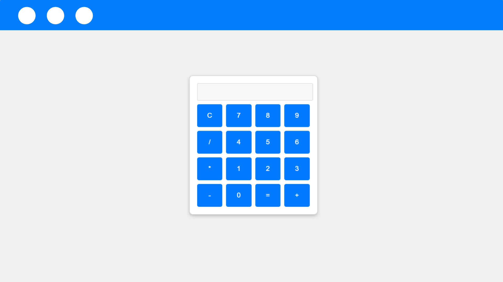

# Overview
#### This project is a simple calculator built using HTML, CSS, and JavaScript. It provides a user-friendly interface for performing basic arithmetic operations such as addition, subtraction, multiplication, and division. The calculator is designed to be responsive and works seamlessly across different devices.

# Live Demo
#### [View the live demo](https://calculator-said.vercel.app)

# Table of Contents
### Features
### Technologies Used
### Usage
### Contributing
### License

# Features
- Basic Operations: Perform addition, subtraction, multiplication, and division.
- Clear Functionality: Clear the input with a single button click.
- Responsive Design: Works well on both desktop and mobile devices.
User-Friendly Interface: Intuitive layout for easy use.

# Technologies Used
- HTML: For the structure of the application.
- CSS: For styling and layout.
- Javascript: For functionality and interactivity.

# Usage
- Click on the number buttons to input numbers.
- Use the operation buttons (+, -, *, /) to select the desired operation.
- Click the "=" button to calculate the result.
- Use the "C" button to clear the input.

# Contributing
#### Contributions are welcome! If you have suggestions for improvements or new features, feel free to fork the repository and submit a pull request.

# License
#### This project is licensed under the MIT License. See the LICENSE file for details.